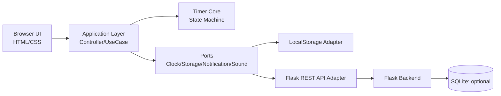

# Pomodoro Timer Webアプリケーション アーキテクチャ案

## 1. 目的と方針

本プロジェクトでは、Flask + HTML/CSS/JavaScript で Pomodoro タイマーを実装する。

初期方針は次の通り。

- タイマー制御はクライアント主導（ブラウザ）
- Flask は画面配信と API 提供に集中
- 将来拡張（ユーザー管理、履歴分析、同期機能）を見据えた責務分離
- ユニットテストしやすい構造を最初から採用

---

## 2. 全体アーキテクチャ



### レイヤー責務

- UI層: 表示、ユーザー入力、アクセシビリティ対応
- Application層: 画面イベントとドメインイベントの仲介、ユースケース実行
- Core層: タイマー状態遷移の純粋ロジック（副作用なし）
- Ports/Adapters層: 時刻取得、保存、通知、音再生など副作用の実装
- Backend層: 設定・ログの API、静的ファイル配信

---

## 3. タイマー制御設計（クライアント主導）

### 3.1 状態モデル

- `focus`
- `short_break`
- `long_break`
- `paused`

### 3.2 イベントモデル

- `start`
- `pause`
- `resume`
- `reset`
- `skip`
- `tick`
- `complete`

### 3.3 コアロジック

状態遷移は reducer 形式の純粋関数で定義する。

- 入力: `state`, `event`
- 出力: `nextState`

これにより、DOM や API に依存しないユニットテストが可能になる。

### 3.4 時間計算の原則

残り秒数の単純デクリメントではなく、終了予定時刻 `endAt` を保持して毎 tick 再計算する。

- `remaining = max(0, endAt - now)`

この方式により、タブ非アクティブ時や復帰時の時間ズレに強くなる。

---

## 4. データ設計

### 4.1 設定（Settings）

- `focus_minutes`
- `short_break_minutes`
- `long_break_minutes`
- `long_break_interval`
- `auto_start_break`
- `auto_start_focus`
- `notification_enabled`
- `sound_enabled`

### 4.2 実行状態（Runtime State）

- `mode`（focus / short_break / long_break / paused）
- `started_at`
- `end_at`
- `completed_focus_count`
- `is_running`

### 4.3 履歴（Session Log, optional）

- `mode`
- `started_at`
- `ended_at`
- `planned_seconds`
- `actual_seconds`
- `completed`（true/false）

初期段階では設定と実行状態を LocalStorage に保存し、履歴要件が出た段階で SQLite を導入する。

---

## 5. Flask バックエンド設計

Flask は薄い API 層として実装する。

### 5.1 主要責務

- 画面（テンプレート）と静的ファイルの配信
- 設定取得・更新 API
- セッション履歴 API（必要時）

### 5.2 API 例

- `GET /api/settings`
- `PUT /api/settings`
- `POST /api/sessions`
- `GET /api/sessions?date=YYYY-MM-DD`（optional）

### 5.3 設計上の注意

- 秒ごとのカウントダウンをサーバーで持たない
- サーバー側は状態の保存と参照に限定
- バリデーションはスキーマで明示化（pydantic / marshmallow など）

---

## 6. フロントエンド構成案

```text
1.pomodoro/
  app.py
  templates/
    index.html
  static/
    css/
      style.css
    js/
      core/
        timer_state_machine.js
      app/
        timer_controller.js
        presenter.js
      infra/
        clock.js
        storage_adapter.js
        api_adapter.js
        notification_service.js
        sound_service.js
```

### 構成の意図

- `core`: 純粋ロジックのみ
- `app`: 画面操作をユースケースに変換
- `infra`: 副作用を隔離

---

## 7. テスト戦略（重視）

## 7.1 ユニットテスト優先順位

1. Core 状態遷移テスト
2. 時間計算テスト（FakeClock 使用）
3. Application ユースケーステスト
4. Adapter 契約テスト
5. Flask API テスト

### 7.2 テスト容易性のための改善ポイント

- `Date.now()` 直接呼び出し禁止（Clock ポート経由）
- LocalStorage / API / Notification / Audio はインターフェース化
- Core は副作用ゼロを維持
- UI は Presenter で ViewModel 化し、DOM 依存を削減
- API 入出力はスキーマバリデーションで境界を固定

### 7.3 テストツール例

- Python: `pytest`, `Flask test client`
- JavaScript: `vitest` または `jest`

---

## 8. 開発ステップ（推奨）

1. Flask の最小起動と 1 画面配信
2. タイマー状態機械（Core）を先に実装 + 単体テスト
3. Controller / Presenter で UI 接続
4. LocalStorage 保存を追加
5. Flask 設定 API 連携
6. 通知・音・アクセシビリティ対応
7. 必要に応じて SQLite 履歴機能を追加

---

## 9. 将来拡張

- ユーザー認証とクラウド同期
- 日/週単位の実績可視化（集中時間、達成セッション数）
- PWA 化（オフライン利用、ホーム画面追加）
- マルチデバイス同期

この設計により、MVP の実装速度と、将来の機能拡張・テスト容易性を両立できる。
